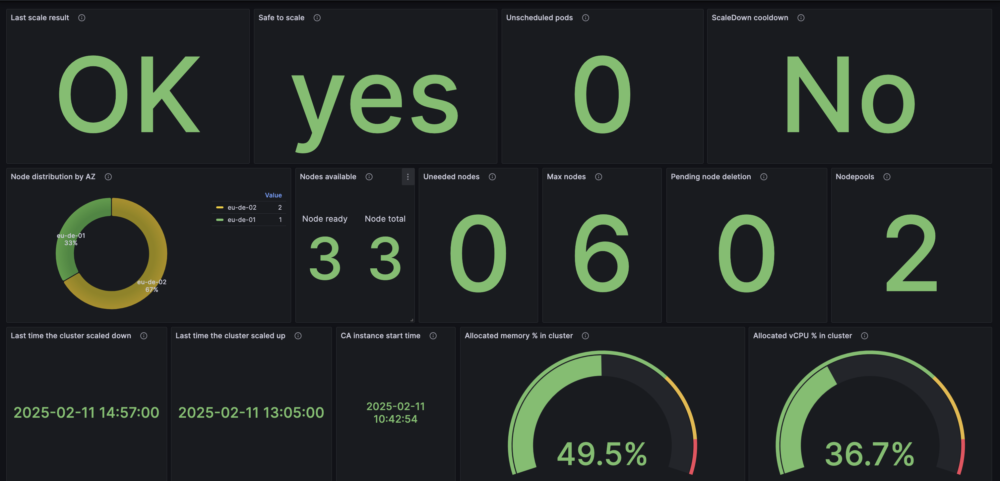
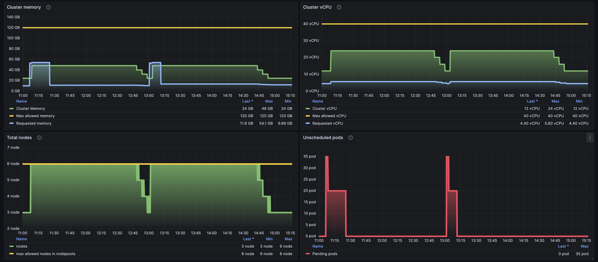
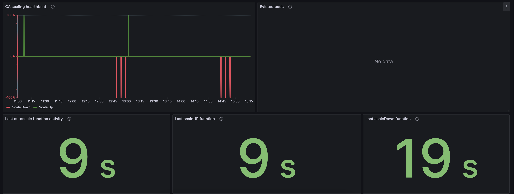

# Introduction
In dynamic Kubernetes environments, ensuring efficient resource utilization while maintaining application performance is crucial. The CCE Cluster Autoscaler(CA) automatically adjusts the number of nodes in a cluster based on workload demand, but without proper visibility, troubleshooting scaling issues can be challenging.

This preconfigured Grafana dashboard provides real-time insights into autoscaler behavior, helping you:

- Monitor unschedulable pods to prevent resource bottlenecks.
- Analyze scaling trends to optimize cluster costs and performance.
- Gain visibility into CPU and memory utilization thresholds affecting scaling decisions.

# Requirements
- Grafana
- Prometheus (kube-state-metrics)
- CCE Cluster Autoscaler (It is recommended to run 1 replica)

# How to interpret the dashboard panels

### Last scale result
- Result of the last scale operation.

### Safe to scale
- Whether or not cluster is healthy enough for autoscaling. 1 if it is, 0 otherwise.

### Unscheduled pods
- Number of unschedulable ("Pending") pods in the cluster.

### ScaleDown cooldown
- Whether or not the scale down is in cooldown. 1 if its, 0 otherwise.

### Node distribution by AZ
- How cluster nodes are distributed over Availability Zones.

### Nodes available
- Current total nodes and available nodes in the cluster.

### Uneeded nodes
- Number of nodes currently considered unneeded by CA.

### Max nodes
- Maximum number of nodes allowed in all nodepools. Be warned this value comes from nodepools and not from CA "maxNodesTotal".

### Pending node deletion
- Number of nodes that haven't been removed or aborted after finished scale-down phase. 

### Nodepools
- Number of nodepools managed by CA.

### Last time the cluster scaled down
- Last time when the CA removed node from the cluster.

### Last time the cluster scaled up
- Last time when the CA added node to the cluster.

### CA instance start time
- It is important to know when the current CA instance started. Counter based metrics will reset at that time like scaled_up_nodes_total and scaled_down_nodes_total

### Allocated memory % in cluster
- Percentage of requested memory / sum of cluster memory.

### Allocated vCPU % in cluster
- Percentage of requested vCPU / sum of cluster vCPU.

### Cluster memory
- Current, requested and maximum(memoryTotal) memory of the cluster.

### Cluster vCPU
- Current, requested and maximum(coresTotal) vCPU of the cluster.

### Total nodes
- Current nodes count and the maximum number of nodes allowed by nodepools.

### Unscheduled pods
- Number of unschedulable ("Pending") pods in the cluster.

### CA scaling hearthbeat
- Nodes added and removed by CA. Nodes number is not always accurate when multiple nodes are added/destroyed at the same time, it just shows autoscaling activity. See dashboard above for node numbers.

### Evicted pods by CA
- Number of pods evicted by CA. (No data = no evictions)

### Last autoscale function activity
- Current state of the cluster has been updated, started autoscaling logic.

### Last scaleUP function
- Last time CA checked if scale up is necessary.

### Last scaleDown function
- Last time CA checked if scale down is necessary.
