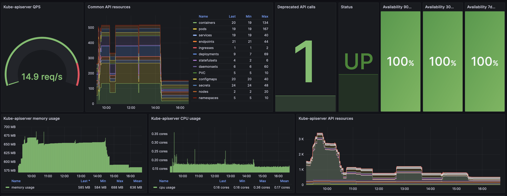
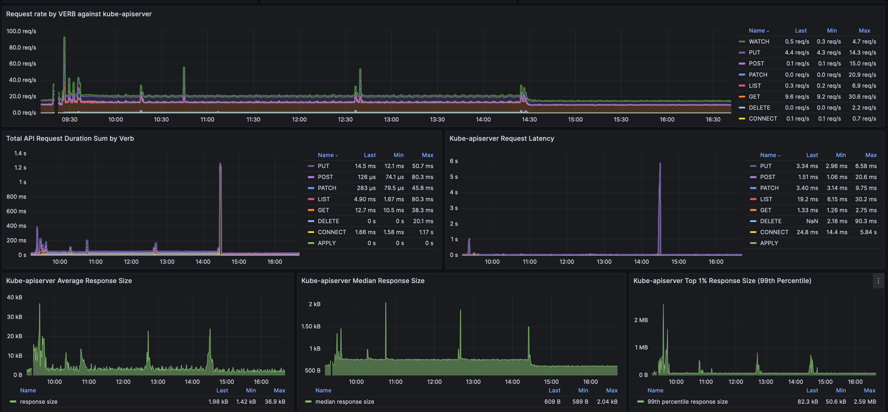
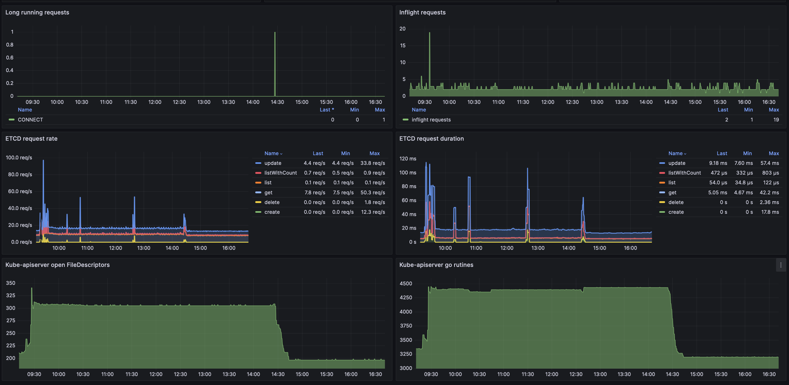

# Introduction

Monitoring the Kubernetes API (kube-apiserver) can be a daunting task, especially when you're using a managed Kubernetes service. Managed Kubernetes abstracts many of the underlying complexities, which can make it challenging to understand the inner workings and health of the kube-api. This is further complicated by the shared responsibility model: while the cloud provider manages the infrastructure, users still have the power to impact the kube-api with their own workloads. Examples include Kyverno policies and custom controllers or large deployments, which can introduce performance issues or unexpected behavior. Kubernetes exposes a vast array of metrics through its API, providing comprehensive insights into the performance and health of the cluster. They offer detailed information on resource usage, operational states, and system performance, making them invaluable for monitoring and troubleshooting.

For a detailed list and descriptions of these metrics, refer to the official Kubernetes Metrics [Documentation](https://kubernetes.io/docs/reference/instrumentation/metrics/trfg).

To help Cloud Container Engine (CCE) users with the tools they need to troubleshoot kube-api performance issues, we have developed a specialized kube-api monitoring dashboard. This dashboard provides clear, actionable insights into the performance and health of the kube-api, helping users quickly identify and address potential problems.

# How to interpret the dashboard panels

### Kube-apiserver QPS:

    Description: Displays the current Queries Per Second (QPS) against the kube-apiserver. This metric is crucial for understanding the load on your API server and helps identify if the API is being overwhelmed by requests.
    Importance: Monitoring QPS allows you to gauge the overall traffic and workload on your kube-apiserver, helping in capacity planning and performance tuning.
    Metric: `apiserver_request_total`

### Common API Resources:

    Description: Provides metrics on current and historical counts of common API resources such as deployments, pods, and services.
    Importance: Tracking these resources helps you understand the scale of your applications and services, ensuring that resource usage aligns with expected configurations and identifying any anomalies.
    Meetrics: `kube_pod_container_status_running, kube_pod_status_phase, kube_service_info, kube_endpoint_info, kube_ingress_info, kube_deployment_status_replicas_available, kube_statefulset_status_replicas_ready, kube_daemonset_status_number_ready, kube_persistentvolumeclaim_info, kube_configmap_info, kube_secret_info, kube_node_info, kube_namespace_created, kube_networkpolicy_created`

### Deprecated API Calls:

    Description: Shows recent usage of deprecated APIs. This metric helps in identifying if any applications or services are using outdated API versions.
    Importance: Monitoring deprecated API calls is essential for maintaining compatibility with newer API versions and preventing potential disruptions due to deprecated features.
    Metric: `apiserver_requested_deprecated_apis`

### Status:

    Description: Displays the current status of the kube-apiserver, providing a snapshot of its operational state.
    Importance: Understanding the status of the kube-apiserver helps in quickly detecting and addressing issues that may affect cluster operations.
    Metric: `up`

### Availability (7d/30d/90d):

    Description: Shows the availability percentage of the kube-apiserver over 7, 30, and 90-day periods.
    Importance: Monitoring availability over different timeframes provides insights into the reliability and uptime of the kube-apiserver, helping to identify long-term trends and potential stability issues.
    Metric: `up`

### Kube-apiserver Memory Usage:

    Description: Tracks current and historical memory usage of the active kube-apiserver.
    Importance: Memory usage metrics are crucial for detecting memory leaks or inefficiencies and ensuring that the kube-apiserver has sufficient resources to handle its load effectively.
    Metric: `process_resident_memory_bytes`

### Kube-apiserver CPU Usage:

    Description: Displays current and historical CPU usage of the active kube-apiserver.
    Importance: Monitoring CPU usage helps in identifying performance bottlenecks and ensuring that the kube-apiserver has adequate processing power to handle requests.
    Metric: `process_cpu_seconds_total`

### Kube-apiserver API Resources:

    Description: Provides metrics on all current and historical API resources in the kube-apiserver.
    Importance: Tracking API resources helps in understanding how the kube-apiserver is interacting with different resources and can highlight potential performance issues.
    Metric: `apiserver_storage_objects`

### Request Rate by Verb Against Kube-apiserver:

    Description: Calculates the current and historical QPS grouped by verbs (e.g., GET, POST, PATCH) against the kube-apiserver.
    Importance: Grouping by verbs helps in understanding the types of operations being performed and identifying which types of requests are most frequent, providing insights into potential performance impacts.
    Metric: `apiserver_request_total`

### Total API Request Duration Sum by Verb:

    Description: Sums the total request duration by verb over a specified period of time.
    Importance: This metric helps in understanding how long different types of requests take to process, aiding in performance optimization and identifying slow operations.
    Metric: `apiserver_request_duration_seconds_sum`

### Kube-apiserver Request Latency:

    Description: Calculates request latency grouped by verbs.
    Importance: Monitoring request latency by verb helps identify which types of operations may be experiencing delays, enabling targeted performance improvements.
    Metric: `apiserver_request_duration_seconds_sum / apiserver_request_duration_seconds_count`

### Kube-apiserver Average Response Size:

    Description: Calculates the average size of responses returned by the kube-apiserver.
    Importance: Tracking average response sizes helps in understanding the data load and ensuring that responses are within expected size limits, which can impact network performance and resource usage.
    Metric: `apiserver_response_sizes_sum / apiserver_response_sizes_count`

### Kube-apiserver Median Response Size:

    Description: Shows the median size of responses returned by the kube-apiserver.
    Importance: Monitoring the median response size helps in identifying typical response sizes and assessing whether any unusual data sizes are impacting performance.
    Metric: `apiserver_response_sizes_sum / apiserver_response_sizes_count`

### Kube-apiserver 99th Percentile Response Size:

    Description: Calculates the 99th percentile of response sizes, showing the largest 1% of responses.
    Importance: This metric is useful for understanding the upper extremes of response sizes and identifying any outliers that may affect performance or resource usage.
    Metric: `apiserver_response_sizes_sum / apiserver_response_sizes_count`

### Long Running Requests:

    Description: Displays metrics related to requests that are taking unusually long to complete.
    Importance: Identifying long-running requests helps in diagnosing performance issues and ensuring that requests are processed efficiently.
    Metric: `apiserver_longrunning_requests`

### Inflight Requests:

    Description: Shows the number of requests currently being processed by the kube-apiserver.
    Importance: Monitoring inflight requests helps in understanding the current load and capacity of the kube-apiserver, which can be critical for performance tuning and troubleshooting.
    Metric: `apiserver_current_inflight_requests`

### ETCD Request Rate:

    Description: Displays the rate of requests made to the etcd database.
    Importance: Monitoring etcd request rates helps in understanding the load on the etcd database, which is critical for the overall performance and stability of the Kubernetes control plane.
    Metric: `etcd_request_duration_seconds_count`

### ETCD Request Latency:

    Description: Shows the latency of requests made to the etcd database.
    Importance: Tracking etcd request latency helps in diagnosing performance issues with etcd, which can impact the responsiveness and stability of the Kubernetes cluster.
    Metric: `etcd_request_duration_seconds_sum`

### Kube-apiserver Open File Descriptors:

    Description: Displays the number of open file descriptors used by the kube-apiserver.
    Importance: Monitoring open file descriptors is important for detecting potential resource exhaustion issues that could affect the kube-apiserver's ability to handle connections.
    Metric: `process_open_fds`

### Kube-apiserver Go Routines:

    Description: Shows the number of Go routines currently used by the kube-apiserver.
    Importance: Tracking Go routines helps in understanding the concurrency and potential bottlenecks within the kube-apiserver, aiding in performance tuning and optimization.
    Metric: `go_goroutines`

